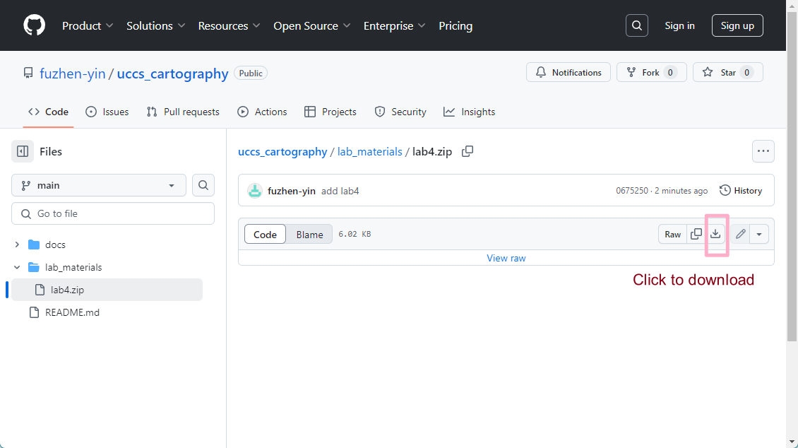
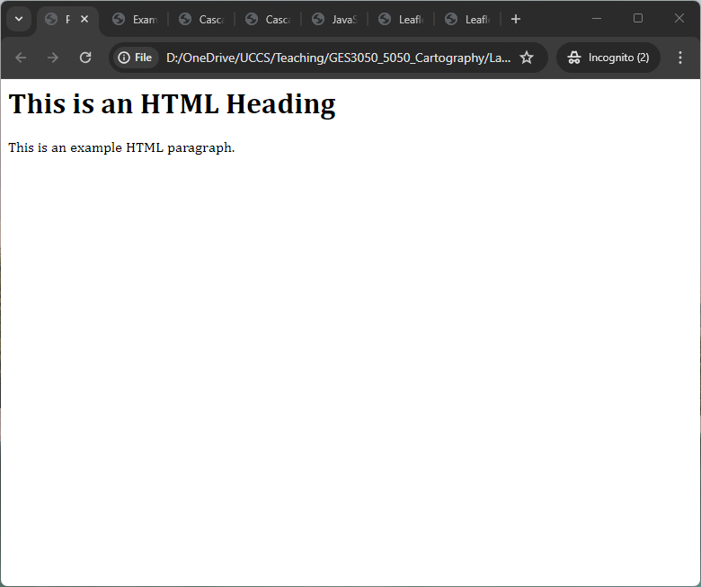
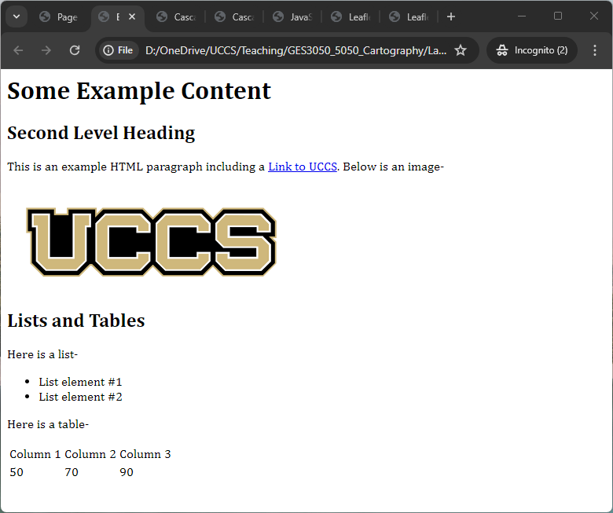
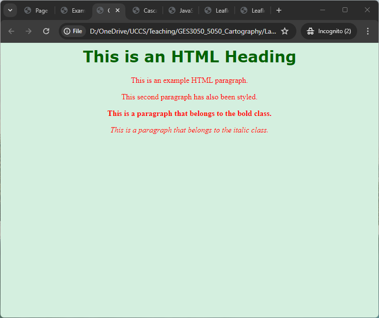
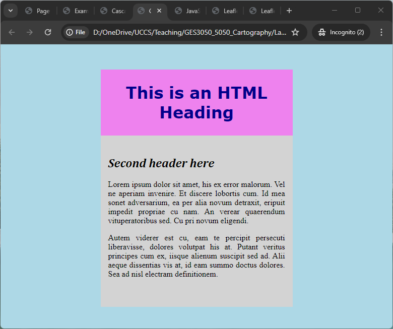
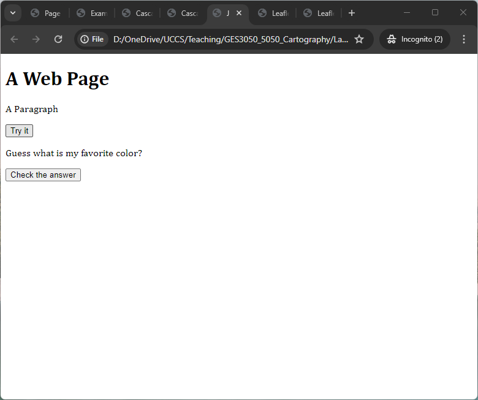
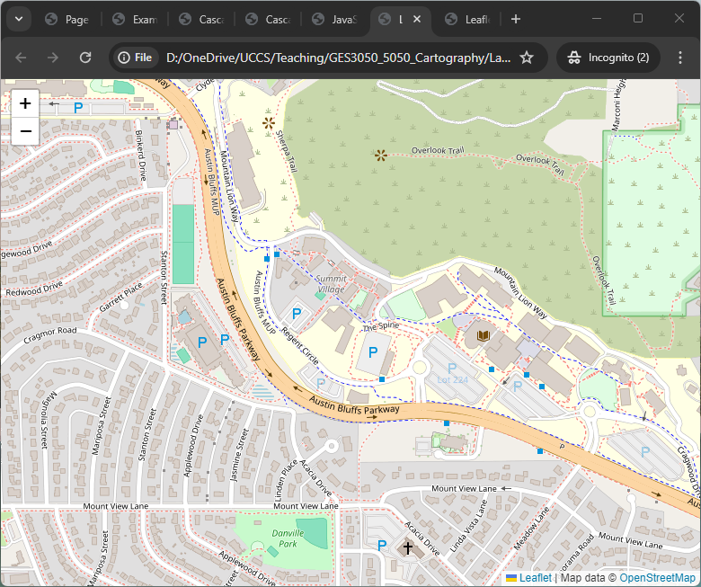
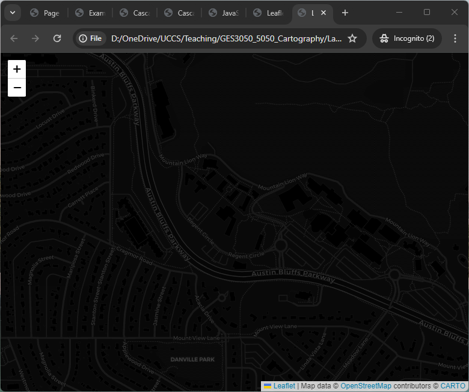

```{r setup, include=FALSE}
knitr::opts_chunk$set(echo = TRUE)
```


## Overview

:::: {.bluebox data-latex=""}
::: {.left data-latex=""}
**Submission**
:::

Please carefully read the instruction and all 6 examples. At the end, please DIY a simple web page using HTML for any topics... Then, submit your web page (.html) on Canvas. 


The zip file containing all examples can be found here: https://github.com/fuzhen-yin/uccs_cartography/blob/main/lab_materials/lab4.zip. The image below explains how to download from the link. 

::::

<br>

{width=70%}
<br>

## Getting Setup with an HTML Editor and Browser
The first step in creating an interactive mapping web site is to get setup with a **text editor** that can create HTML pages. Some common text editor software examples are:

* http://brackets.io/ 
* https://atom.io/ 
* http://www.sublimetext.com/ 

Download **one** of these text editors on your laptop and create a new file. 

## Creating a First Web Page 
Using one of these text editors, you can create a very simple **HTML** page like the code below. This shows the basic structure of an HTML page. 

> Elements are the basic building blocks of HTML which are defined by an opening tag and end with a closing tag. 

The entire page is within the ``` <html> ``` element. The core HTML elements are the ``` <head> ``` (including document wide properties like the title tag) and the ``` <body> ``` (the content of the page)

### Example 1

```{html, eval=FALSE}
<html>

<head>
	<title>Page Title Here</title>
</head>

<body>
	<h1>This is an HTML Heading</h1>
	<p>This is an example HTML paragraph.</p>
</body>

</html>

```

Save this file as **example1.html**. 

> When you double click on the html file you have created, it should open in your **default web browser** software, and show the text as the Fig. 4.1

{width=70%}
<br>


## Adding More HTML Elements 

### Example 2

Now we will add some of the most common HTML elements. 
The _**link element**_ ``` <a> ``` defines links to other web pages such as: 

>   ``` <a href='https://www.uccs.edu/'>Link to UCCS</a> ```

This element includes an ‘attribute’, which is a property of the element which is defined in the opening tag. In this case it is the URL of the link. 

The _**image element**_ ```  ``` displays images on the web page. The image file needs to be in the _same folder_ as the HTML file (and would need to uploaded to the server on a live site): 

> ```  ```

The _**unordered list element**_ ``` <ul> ``` structures text as a bullet point list, while the _**ordered list element**_ ``` <ol> ``` structures text as a numbered list. 

The _**table element**_ ``` <table> ``` structures text in a table format. 

Here is an example with these elements included: 

```{html, eval=FALSE}
<html>
<head>
	<title>Example Page 2: Adding HTML Elements</title>
</head>

<body>
	<h1>Some Example Content</h1>
	<h2>Second Level Heading</h2>
	<p>This is an example HTML paragraph including a <a href='https://www.uccs.edu/'>Link to UCCS</a>. Below is an image-</p>
	<p></p>

	<h2>Lists and Tables</h2>
	<p>Here is a list-</p>
	<ul><li>List element #1</li><li>List element #2</li></ul>

	<p>Here is a table-</p>
	<table>
		<tr>
			<td>Column 1</td>
			<td>Column 2</td>
			<td>Column 3</td>
		</tr>
		<tr>
			<td>50</td>
			<td>70</td>
			<td>90</td>
		</tr>
	</table>

</body>
</html>
```

Save this file as **example2.html**. 

When you double click on the html file you have created, it should open in your **default web browser** software, and show the text as the Fig. 4.2

{width=70%}

<br> 


## Adding Stylesheets

We have created example pages with some content, but we have not added any presentational elements to this page. Typically, the default **fonts** and **layout** on web pages look very basic. 

> Styles are applied to improve the page design. Styles can be applied to web page content by **defining style rules in the HTML _header_**, or by **linking to an external stylesheet** (e.g. “example.css”) which contains similar content. 

It is also possible to define styles **inline** in the attributes of a tag, though this is generally regarded as _bad practice_. 

The following example shows how to change the font styling of the ``` body ```, ``` h1 ``` and ``` p ``` elements by defining styles within a style element in the **page head**. The styles are contained within **curly brackets** ``` {} ```, with each property separated by a **semi-colon** ``` ; ```. The ``` h1 ``` and ``` p ``` styles will apply to all instances of these tags. It is possible to define classes of styles to control which elements have styles applied, as shown in the ``` bold ``` class example below. Note American English spelling is used (e.g. ‘color’ not ‘colour’):

> The HEX values of different colors can be found here: https://htmlcolorcodes.com/

### Example 3


```{html, eval=FALSE}
<html>
<head>
	<title>Cascading Style Sheets (CSS) Example Page</title>


<style>
body {
	background-color: #D4EFDF;
	}
h1 {
	color: darkgreen;
	text-align: center;
	font-family: verdana;}
p {
	color: red;
	text-align: center;
	font-family: times;}
p.bold {
	font-weight: bold;}
p.italic {
	font-style: italic;}


</style>

</head>

<body>
<h1>This is an HTML Heading</h1>
<p>This is an example HTML paragraph.</p>
<p>This second paragraph has also been styled.</p>
<p class="bold">This is a paragraph that belongs to the bold class.</p>

<p class="italic">This is a paragraph that belongs to the italic class.</p>

</body>
</html>

```

Save this file as **example3.html**. Double click on the html file you have created to open it in your **default web browser** software. The web page should look similar to 4.3:

{width=70%}

<br> 


### Example 4


When styling the **layout** of a page, the _**divider or ``` <div> ``` element**_ is very often used. 

> The divider element defines a page block such as a header or footer or sidebar which can be positioned and styled on the page. 

To style the divider it needs to be defined by giving it a unique **id** attribute (this is different from the class attribute which refers to groups of elements and is not unique). The **id** is referred to in the header styles using the **hashtag** ``` # ``` symbol: 

```{html, eval=FALSE}
<html>
<head>
<title>Cascading Style Sheets (CSS) Example Page with Dividers </title>

<style>
body {
	background-color: lightblue;
	}
#pagediv {
	margin: auto;
	width: 50%;
	background-color:lightgrey;
	}
#headerdiv {
	background-color:#ee82ee;
	margin-top: 50px;
	margin-bottom: 15px;
	padding: 5px 0 5px 0;
	}
#contentdiv {
	margin-top: 15px;
	margin-bottom: 15px;
	padding: 5px 15px 40px 15px;
	}
h1 {
	color: darkblue;
	text-align: center;
	font-family: verdana;}
h2{
	font-style: italic;
}
p {
	text-align: justify;
	font-family: times}

</style>

</head>

<body>

<div id="pagediv">

	<div id="headerdiv">
		<h1>This is an HTML Heading</h1>
	</div>

	<div id="contentdiv">
		<h2>Second header here</h2>
		<p>Lorem ipsum dolor sit amet, his ex error malorum. Vel ne aperiam invenire. Et discere lobortis cum. Id mea sonet adversarium, ea per alia novum detraxit, eripuit impedit propriae cu nam. An verear quaerendum vituperatoribus sed. Cu pri novum eligendi.</p>
		<p>Autem viderer est cu, eam te percipit persecuti liberavisse, dolores volutpat his at. Putant veritus principes cum ex, iisque alienum suscipit sed ad. Alii aeque dissentias vis at, id eam summo doctus dolores. Sea ad nisl electram definitionem.</p>
	</div>

</div>

</body>
</html>
```

Save this file as **example4.html**. Double clicking on the html file you have created to open it in your **default web browser** software. The web page should look similar to 4.4:

{width=70%}

<br> 

## HTML and JavaScript 

Interactive and dynamic websites include **scripts** to respond to user behaviour and inputs. All interactive visualisation pages using scripts in one form or another. The most common web scripting language is **JavaScript**, and it is straightforward to **include JavaScript within HTML pages**. 

Note there are particular aspects of JavaScript on webpages (interpreted, asynchronous, strict web security) that make it different to running compiled code on your own machine. We will discuss these aspects further during the labs. 

> **JavaScript** is added to HTML pages using the ``` <script> ``` element. One of the most common JavaScript uses is to respond to a user input, such as pressing a button. 

In the following example, a function is run when the user clicks a button. The function changes the content and styling of a paragraph with the ids ``` demo ``` and ``` demo2 ```:  

### Example 5


```{html, eval=FALSE}
<!DOCTYPE html>
<html>
<head><title>JavaScript Example Page</title></head>
<body>

<h1>A Web Page</h1>
<p id="demo">A Paragraph</p>
<button type="button" onclick="myFunction()">Try it</button>

<p id="demo2"> Guess what is my favorite color? </p>
<button type="button" onclick="myFunction_color()">Check the answer</button>


<script>
function myFunction() {
 document.getElementById("demo").innerHTML = "Paragraph has changed content and style.";
 document.getElementById("demo").style.fontSize = "35px";
}

function myFunction_color(){
	document.getElementById("demo2").innerHTML = "My favorite is GREEN!!"
	document.getElementById("demo2").style.color = "green";
}

</script>

</body>
</html> 
```

Save this file as **example5.html**. Double clicking on the html file you have created to open it in your **default web browser** software. The web page should look similar to 4.5:

{width=70%}

<br> 

## Leaflet.js Mapping Example 

We will look in detail at interactive mapping sites next week. Interactive mapping sites use all the **JavaScript** and **stylesheet** features we have discussed to create interactive mapping visualizations. 

An example of a simple mapping site is included below. It uses the **Leaflet mapping library**, which is a popular **open source** library for online interactive maps. It is a very _lightweight_ and _straightforward_ to use library. 

The API and documentation for **Leaflet.js** is here: http://leafletjs.com/

Below is a simple html page to create a map with **OpenStreetMap** data as the **background layer**. There are some important features to note. 

* Firstly, to use the Leaflet library, we need to refer to an **external script** containing the Leaflet library code, and a **stylesheet** for the Leaflet library. This is achieved in document header using ``` <link> ``` and ``` <script> ``` tags with links to online copies of the files. The integrity and crossorigin tags are relatively recent additions to HTML, intended to ensure that the external resource being loaded have not been modified from the original.

* Secondly, to create a **full-screen** map, we create a ``` #mapdiv ``` element that is given a width of 100%, absolute positioning, and borders of 0 to fill the entire browser screen. 

* Thirdly, in the body of the page we need a ``` <script> ``` to define the map. The script calls the Leaflet commands to create the map. A ``` L.map ``` variable is invoked, specifying the **latitude, longitude and zoom level** of the map in the ``` setview ``` attributes. Then the ``` L.tileLayer ``` command specifies what mapping data will be used as the background layer, linking to a set of tiles on an online map server. 

Here we request the **OpenStreetMap raster tiles layer**, and add this layer to the map. The nature of online mapping data will all become clearer in next week’s session. 

### Example 6


```{html, eval=FALSE}
<html>
<head>

<title>Leaflet Example Page</title>

<link rel="stylesheet" href="https://unpkg.com/leaflet@1.9.4/dist/leaflet.css"
   integrity="sha256-p4NxAoJBhIIN+hmNHrzRCf9tD/miZyoHS5obTRR9BMY="
   crossorigin=""/>

 <script src="https://unpkg.com/leaflet@1.9.4/dist/leaflet.js"
   integrity="sha256-20nQCchB9co0qIjJZRGuk2/Z9VM+kNiyxNV1lvTlZBo="
   crossorigin=""></script>


<style>
	body { margin:0; padding:0; }
	#mapdiv { position:absolute; top:0; bottom:0; width:100%; }
</style>

</head>


<body>

<div id="mapdiv"></div>
<script>
var mymap = L.map('mapdiv').setView([38.8928, -104.8036], 16);

L.tileLayer('http://{s}.tile.openstreetmap.org/{z}/{x}/{y}.png', {
	maxZoom: 18,
	attribution: 'Map data &copy; <a href="http://openstreetmap.org">OpenStreetMap</a>'
	}).addTo(mymap);
</script>

</body>
</html>

```

Save this file as **example6.html**. Double clicking on the html file you have created to open it in your **default web browser** software. The web page should look similar to 4.6:


{width=70%}

<br> 

It’s possible to swap the tileLayer for another map layer that you want to use, for example the **Carto All Black** map layer (also created using OpenStreetMap data): 


```{html, eval=FALSE}
...

L.tileLayer('https://{s}.basemaps.cartocdn.com/dark_all/{z}/{x}/{y}{r}.png', {
	maxZoom: 18,
	attribution: 'Map data &copy; <a href="https://www.openstreetmap.org/copyright">OpenStreetMap</a> contributors &copy; <a href="https://carto.com/attributions">CARTO</a>'
	}).addTo(mymap);

...
```

If you can change the map tile successfully, the web page should look similar to: 

{width=70%}

<br>

## DIY Your First Web Page

Based on this tutorial, please try to adapt the code to DIY a simple web page to present a topic  ... You can use it to introduce your self, to express your interests in Cartography, etc. 

**Please submit your ``` .html ``` file with all supporting materials (e.g., figures) on Canvas**. 


## Preparation for Next Week

In addition to completing this lab, we are going to be using the mapping cloud service Mapbox next week to show the power of the latest online mapping tools. 

To use **Mapbox**, you would need to create a free Mapbox account. Go to the following link and create a free account:
https://www.mapbox.com/ 

We would use **GitHub** to publish websites and make them accessible. Please also create a free GitHub account:  https://github.com/

