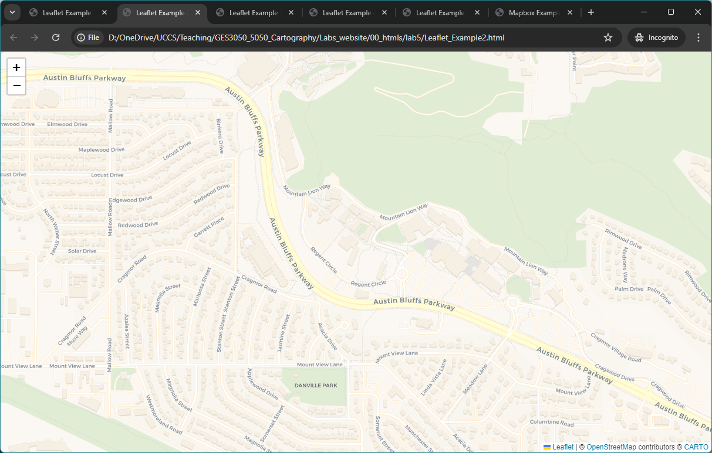
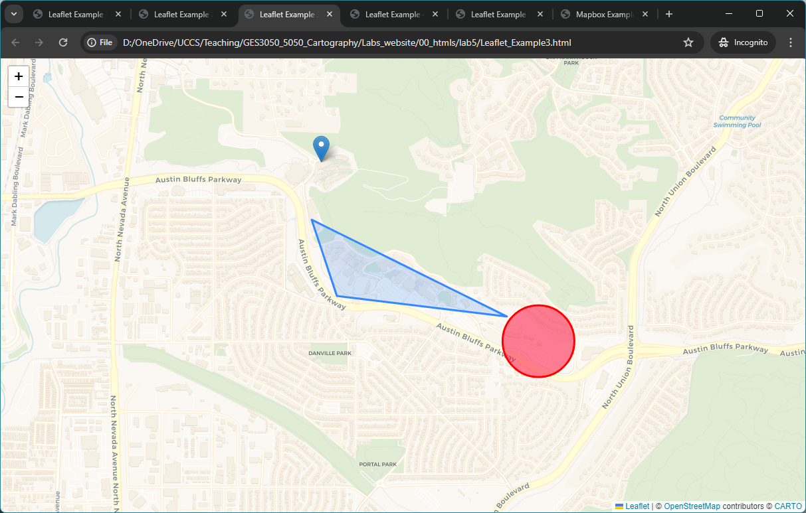
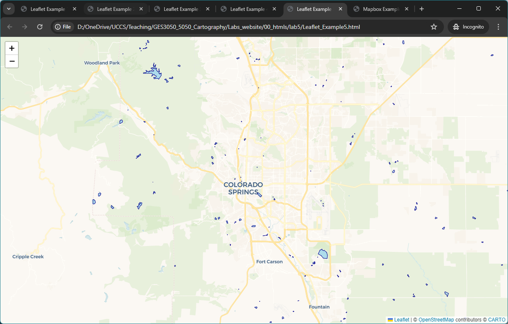
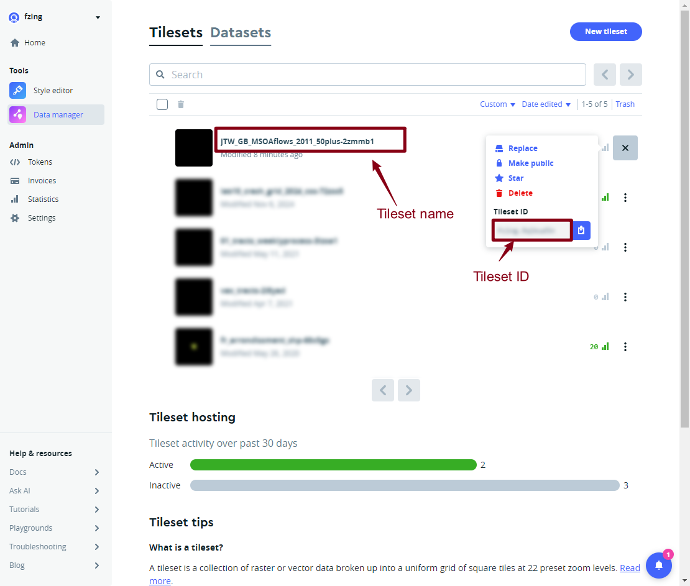
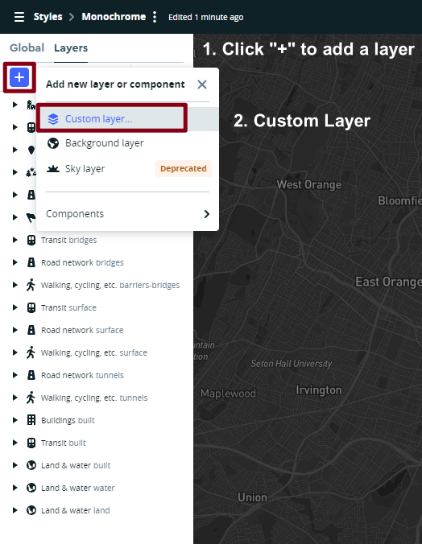
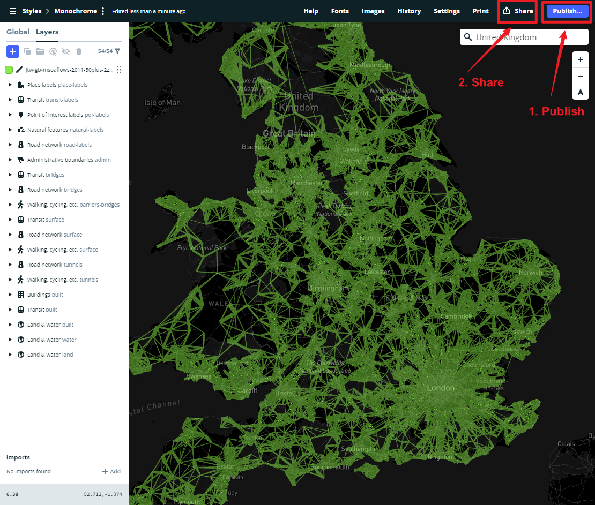
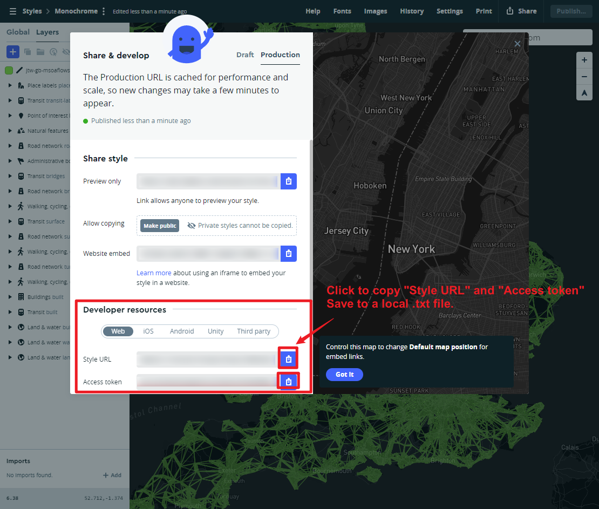
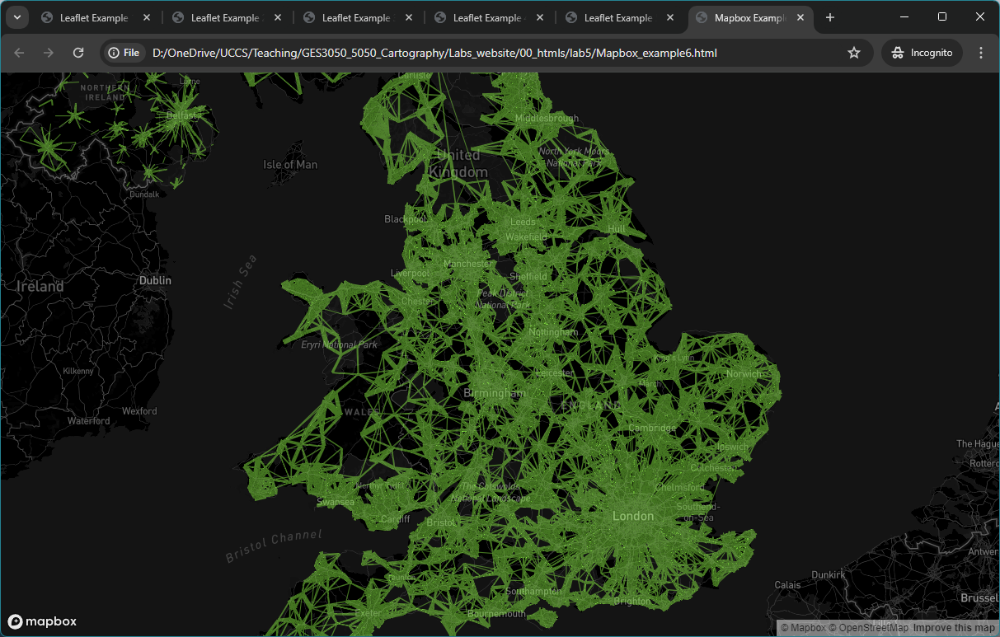

```{r setup, include=FALSE}
knitr::opts_chunk$set(echo = TRUE)
```

## Overview

This Lab provides an introduction to basic Interactive mapping techniques using **Leaflet** and **Mapbox**. The aim is to provide an overview of techniques that you can use in your own spatial data visualizations. All the mapping software libraries discussed here have good online 
tutorials where you can explore further mapping examples beyond this lab:

 - http://leafletjs.com/examples.html 
 - https://leafletjs.com/reference-1.6.0.html 
 - https://www.mapbox.com/help/tutorials/ 
 - https://www.mapbox.com/mapbox-gl-js/example/simple-map/ 
 - https://www.mapbox.com/mapbox-gl-js/api 
 
And for a general HTML and JavaScript reference, a good site is:

 - https://www.w3schools.com/html/


:::: {.bluebox data-latex=""}
::: {.left data-latex=""}
**Submission**
:::

Please carefully read the instruction and play with the 6 examples. 
The zip file with Lab 5 materials can be found here: https://github.com/fuzhen-yin/uccs_cartography/blob/main/lab_materials/lab5.zip. (Don't know how to download the data? Please read: [Lab 4 - Overview](https://fuzhen-yin.github.io/uccs_cartography/lab4.html))


At the end of the lab, you are required to:

- Replicate "Leaflet_Example4.html" to a different study area and use symbols (i.e., markers, polygons, circles) to illustrate a topic of interests with popup functions. 
- Replicate "Mapbox_example6.html" using the same flow data but with different mapping styles. 

Please submit a zip with two .html files and any supporting documents (e.g., images) to Canvas. 


::::

<br>

## Good Practice

- Let's first navigate to the course folder, and create a folder called **lab5**. 
- You will need to use the HTML text editor (e.g. Brackets; Sublime Text) that you installed last week. The lab's computers have Brackets installed.

## Leaflet.js Examples

Leaflet is a very popular open source library for online interactive maps. It is **lightweight** and **straightforward** to use, and is ideal for **simpler mapping sites**. The API and documentation for Leaflet.js can be found [here](http://leafletjs.com/)

### Example 1 

Below is a simple html page to create an interactive map with OpenStreetMap data (same example as last week). You can **zoom around** and the map layer will update. 

The important parts of the code are as follows:

- The Leaflet.js library is loaded in the ``` <head> ``` part of the page, using the  ``` <script> ```  tag. 
- Secondly the **leaflet stylesheet** is also requested using the  ``` <link> ```  tag. The stylesheet controls the layout of different elements, and ensures the map and map controls appear in the right place on the page. 
- The **map** itself is created in the  ``` <body> ```  part of the page using a  ``` <div> ```  tag to specify the size and location of the map element, and a  ``` <script> ```  that calls the Leaflet commands to create the map. A  ``` L.map ```  variable is invoked, specifying the **latitude, longitude and zoom level** of the map in the  ``` setview ```  attributes. Then the  ``` L.tileLayer ```  command specifies what data will be used as the background layer, linking to a set of tiles on an online map server. Here we request the OpenStreetMap raster tiles layer, and add this layer to the map. 

```{html, eval=FALSE}

<html>
<head>

<title>Leaflet Example 1</title>

<link rel="stylesheet" href="https://unpkg.com/leaflet@1.9.4/dist/leaflet.css"
   integrity="sha256-p4NxAoJBhIIN+hmNHrzRCf9tD/miZyoHS5obTRR9BMY="
   crossorigin=""/>

 <script src="https://unpkg.com/leaflet@1.9.4/dist/leaflet.js"
   integrity="sha256-20nQCchB9co0qIjJZRGuk2/Z9VM+kNiyxNV1lvTlZBo="
   crossorigin=""></script>


<style>
	body { margin:0; padding:0; }
	#mapdiv { position:absolute; top:0; bottom:0; width:100%; }
</style>

</head>


<body>

<div id="mapdiv"></div>

<script>
var mymap = L.map('mapdiv').setView([38.8928, -104.8036], 16);

L.tileLayer('http://{s}.tile.openstreetmap.org/{z}/{x}/{y}.png', {
	maxZoom: 18,
	attribution: 'Map data &copy; <a href="http://openstreetmap.org">OpenStreetMap</a>'
	}).addTo(mymap);
</script>

</body>
</html>

     
```


Note that in the code we are combining a variable declaration, instantiating the L.map object, and running the setView method in the same statement:

> ``` var mymap = L.map('mapdiv').setView([38.8928, -104.8036], 16); ```

This statement can alternatively be split into two lines, performing the same tasks:

> ``` var mymap = L.map('mapdiv'); ```  <br>
> ``` mymap.setView([38.8928, -104.8036], 16); ```

Save this file as **example1.html**. 

When you double click on the html file you have created, it should open in your **default web browser** software, and show a map as the image below. 

{width=70%}

### Example 2 

It’s possible to swap the tileLayer for another raster map layer that you want to use, for example a Carto All Black tilelayer (also created using OpenStreetMap data):


```{html, eval=FALSE}

<html>
<head>

<title>Leaflet Example 2</title>

<link rel="stylesheet" href="https://unpkg.com/leaflet@1.9.4/dist/leaflet.css"
   integrity="sha256-p4NxAoJBhIIN+hmNHrzRCf9tD/miZyoHS5obTRR9BMY="
   crossorigin=""/>

 <script src="https://unpkg.com/leaflet@1.9.4/dist/leaflet.js"
   integrity="sha256-20nQCchB9co0qIjJZRGuk2/Z9VM+kNiyxNV1lvTlZBo="
   crossorigin=""></script>


<style>
	body { margin:0; padding:0; }
	#mapdiv { position:absolute; top:0; bottom:0; width:100%; }
</style>

</head>


<body>

<div id="mapdiv"></div>

<script>
var mymap = L.map('mapdiv').setView([38.8928, -104.8036], 16);

L.tileLayer('https://{s}.basemaps.cartocdn.com/rastertiles/voyager/{z}/{x}/{y}{r}.png', {
	maxZoom: 18,
	attribution: '&copy; <a href="https://www.openstreetmap.org/copyright">OpenStreetMap</a> contributors &copy; <a href="https://carto.com/attributions">CARTO</a>'
	}).addTo(mymap);
</script>

</body>
</html>

     
```

Save this file as **example2.html**. 

When you double click on the html file you have created, it should open in your **default web browser** software, and show a map as the image below. 

{width=70%}


### Example 3 

So far we have created the background layer to our map. Typically, we want to **add some location data** in the foreground. One simple method of doing this is to **hand-code location data** in our script, as the example below shows using the commands ``` L.marker ``` ,  ``` L.circle ```  and  ``` L.polygon ``` . 


```{html, eval=FALSE}

<html>
<head>

<title>Leaflet Example 3</title>

<link rel="stylesheet" href="https://unpkg.com/leaflet@1.9.4/dist/leaflet.css"
   integrity="sha256-p4NxAoJBhIIN+hmNHrzRCf9tD/miZyoHS5obTRR9BMY="
   crossorigin=""/>

 <script src="https://unpkg.com/leaflet@1.9.4/dist/leaflet.js"
   integrity="sha256-20nQCchB9co0qIjJZRGuk2/Z9VM+kNiyxNV1lvTlZBo="
   crossorigin=""></script>


<style>
	body { margin:0; padding:0; }
	#mapdiv { position:absolute; top:0; bottom:0; width:100%; }
</style>

</head>


<body>

<div id="mapdiv"></div>

<script>
var mymap = L.map('mapdiv').setView([38.8928, -104.8036], 16);

L.tileLayer('https://{s}.basemaps.cartocdn.com/rastertiles/voyager/{z}/{x}/{y}{r}.png', {
	maxZoom: 18,
	attribution: '&copy; <a href="https://www.openstreetmap.org/copyright">OpenStreetMap</a> contributors &copy; <a href="https://carto.com/attributions">CARTO</a>'
	}).addTo(mymap);


var marker = L.marker([38.898586, -104.805672]).addTo(mymap);

var circle = L.circle([38.889592, -104.791615], {
    color: 'red',
    fillColor: '#f03',
    fillOpacity: 0.5,
    radius: 200
}).addTo(mymap);


var polygon = L.polygon([
    [38.89569833939097, -104.80627386295626],
    [38.89186674552239, -104.80462559978713],
    [38.89083179638379, -104.79364069793745]
]).addTo(mymap);


</script>

</body>
</html>


```

Save this file as **example3.html**. 

When you double click on the html file you have created, it should open in your **default web browser** software, and show a map as the image below. 

{width=70%}

### Example 4 

Now, we add popup interactivity to the map by using the functions ``` bindPopup ```  and  ``` openPopup ```. It follows the same html syntax when adding hyperlink such as ``` <a href='https://www.uccs.edu/'>Link to UCCS</a> ```. 

```{html, eval=FALSE}

<html>
<head>

<title>Leaflet Example 4</title>

<link rel="stylesheet" href="https://unpkg.com/leaflet@1.9.4/dist/leaflet.css"
   integrity="sha256-p4NxAoJBhIIN+hmNHrzRCf9tD/miZyoHS5obTRR9BMY="
   crossorigin=""/>

 <script src="https://unpkg.com/leaflet@1.9.4/dist/leaflet.js"
   integrity="sha256-20nQCchB9co0qIjJZRGuk2/Z9VM+kNiyxNV1lvTlZBo="
   crossorigin=""></script>


<style>
	body { margin:0; padding:0; }
	#mapdiv { position:absolute; top:0; bottom:0; width:100%; }
</style>

</head>


<body>

<div id="mapdiv"></div>

<script>
var mymap = L.map('mapdiv').setView([38.8928, -104.8036], 16);

L.tileLayer('https://{s}.basemaps.cartocdn.com/rastertiles/voyager/{z}/{x}/{y}{r}.png', {
	maxZoom: 18,
	attribution: '&copy; <a href="https://www.openstreetmap.org/copyright">OpenStreetMap</a> contributors &copy; <a href="https://carto.com/attributions">CARTO</a>'
	}).addTo(mymap);


var marker = L.marker([38.898586, -104.805672]).addTo(mymap);

var circle = L.circle([38.889592, -104.791615], {
    color: 'red',
    fillColor: '#f03',
    fillOpacity: 0.5,
    radius: 200
}).addTo(mymap);

var polygon = L.polygon([
    [38.89569833939097, -104.80627386295626],
    [38.89186674552239, -104.80462559978713],
    [38.89083179638379, -104.79364069793745]
]).addTo(mymap);


polygon.bindPopup("Hello World! <br> This is the Main Campus of UCCS. <br> <a href='https://www.uccs.edu/'>Link to UCCS</a>").openPopup();
marker.bindPopup("A marker showing the Roaring Fork dining hall")
circle.bindPopup("Here is the UCCS Farm!")

</script>

</body>
</html>

```

Save this file as **example4.html**. 

When you double click on the html file you have created, it should open in your **default web browser** software, and show a map as the image below. 

{width=70%}


### Example 5 

**Hand-coding location features** is not a good way to handle larger datasets. We can add medium sized spatial datasets using the **GeoJSON** format, a popular text-based format for exchanging vector spatial data in JavaScript Object Notation. See [geojson.org](https://geojson.org/) for more information. 

You can create **GeoJSON** files easily in QGIS or ArcGIS from any spatial data file (_"Export->Save Features As"_ for QGIS, or _"Output to GeoJSON"_ for ArcGIS ). Alternatively Google _"convert to geojson"_ and you can find a lot of online data converters.  


We will discuss importing data files on the web using APIs later in the course. The easiest way to add a **GeoJSON** file to a **Leaflet** map is:

> to edit the **GeoJSON** file to create a **.js** file, and wrap the GeoJSON data inside ``` var = myvariablename [….]; ```  (see the ``` elpaso_2022_waterbody_area.js ``` example file included in the lab materials). 

To view the ``` elpaso_2022_waterbody_area.js ```, **right click** and **open with** any text editors (e.g., Brackets, Sublime Text, or Notepad.)


To load an external GeoJSON file without editing, you need to add some asynchronous data loading functionality to Leaflet, such as the Leaflet AJAX plugin or using JQuery. 
The example below loads the file ``` elpaso_2022_waterbody_area.js ``` a local file with the address shown in the code below. 

> ``` <script src="elpaso_2022_waterbody_area.js"></script> ```


This example adds some **water body data** (from the ``` elpaso_2022_waterbody_area.js ``` file) on top of our background map. The water bodies were added using the ``` L.geoJson ``` constructor. The function ``` onEachFeature ``` runs for each feature, which is styled using the ``` layer.setStyle ``` command in the code. 


```{html, eval=FALSE}

<html>
<head>

<title>Leaflet Example 5</title>

<link rel="stylesheet" href="https://unpkg.com/leaflet@1.9.4/dist/leaflet.css"
   integrity="sha256-p4NxAoJBhIIN+hmNHrzRCf9tD/miZyoHS5obTRR9BMY="
   crossorigin=""/>

 <script src="https://unpkg.com/leaflet@1.9.4/dist/leaflet.js"
   integrity="sha256-20nQCchB9co0qIjJZRGuk2/Z9VM+kNiyxNV1lvTlZBo="
   crossorigin=""></script>

   <script src="elpaso_2022_waterbody_area.js"></script>


<style>
	body { margin:0; padding:0; }
	#mapdiv { position:absolute; top:0; bottom:0; width:100%; }
</style>

</head>


<body>

<div id="mapdiv"></div>

<script>
var mymap = L.map('mapdiv').setView([38.859717, -104.801512], 12);

L.tileLayer('https://{s}.basemaps.cartocdn.com/rastertiles/voyager/{z}/{x}/{y}{r}.png', {
	maxZoom: 18,
	attribution: '&copy; <a href="https://www.openstreetmap.org/copyright">OpenStreetMap</a> contributors &copy; <a href="https://carto.com/attributions">CARTO</a>'
	}).addTo(mymap);

var water_js = new L.geoJson(water_area,{
    onEachFeature: onEachFeature
}).addTo(mymap);

function onEachFeature(feature, layer){
    layer.setStyle({
        fillColor:'skyblue',
        fillOpacity: 0.5,
        weight:1,
        color:'darkblue',
        opacity:1
    })
}


</script>

</body>
</html>

```

Save this file as **example5.html**. 

When you double click on the html file you have created, it should open in your **default web browser** software, and show a map as the image below. 

{width=70%}

<br> 
The **GeoJSON** approach will work for relatively **small spatial data** files of a few megabytes. When your files get larger then this text based approach will not scale and the website performance will be slow. You will need to use a different **scalable** approach like **vector tiles**, so that the spatial data is selected depending on the location and zoom level that the user is viewing. 

If you want to add interactivity and further features to your **Leaflet** map, then you can follow the online tutorials here: https://leafletjs.com/examples.html

## Mapbox Introduction 

- Go to [Mapbox.com](https://www.mapbox.com/) (you will need to create a free account if you haven’t already), login and click on **Data Manager** on the left. Then click on **New Tileset**, and **Select a File**. 
- Select the data file ``` JTW_GB_MSOAflows_2011_50plus.zip ``` downloaded from [Lab 5 materials](https://github.com/fuzhen-yin/uccs_cartography/blob/main/lab_materials/lab5.zip.)

There will be a delay while the file is uploaded and processed into Mapbox vector tiles. When it is complete, you will get a notification saying the upload has succeeded, and there will be a new Tileset on the page with a name like ``` JTW_GB_MSOAflows_2011_50plus-xxx ```. Click on it to see the details. 

{width=100%}
<br>
This Tileset page has important information such as the **Map ID** and the **name** (which are used to show this layer in an HTML page using **mapbox.gl**). 

 - It also has the **zoom extent** of the layer. There is a maximum number of features that can be included in each vector tile, and as you zoom out eventually you hit this limit and the layer is no longer displayed. 
 - The vector tiles include the attribute information (columns) from the shapefile, so one quick way to minimize the problem of too narrow a zoom extent is to limit the number of attributes in the original shapefile. 

A more advanced way is to use the Mapbox software Tippecanoe to control how features are dropped at low zoom levels, allowing a wider zoom extent.


{width=100%}

<br>

## Designing a Flowmap in Mapbox Studio 

Now we are going to create a map of the flow data in Mapbox studio. Each map design is called a **style** in Mapbox. 
- Click on the **Style Editor** on the left panel. Then the **arrow** near **New Style** button to create a new style using **Classic Template**.  


{width=100%}

<br>

There are a wide selection of style templates to choose from, mainly using OpenStreetMap (OSM) data. It is interesting to explore these different styles for different projects, with the minimalist **Monochrome** styles generally the default for data visualizations. For this example, we want to use the **Monochrome- Dark** style. 


{width=100%}

<br>

You will then be taken to the Mapbox studio interface for designing background mapping. On the left hand side are all the OSM layers, and on the right hand side is the appearance of the map design (just like in GIS software). 

- Navigate the map to center on the UK. 
- Press the **Add Layer** button (or the **+** symbol) at the top left to add a **Custom Layer** using **journey-to-work flows** Tileset we created earlier (under the name ``` JTW_GB_MSOAflows_2011 ```.


{width=100%}

<br>

{width=100%}

<br>

When added, the **flows** layer will appear on the **left-hand** layers panel. Next we are going to **style** this layer. Click on the layer itself, the style panel will appear.  

- Firstly, change the color to something bright like cyan or orange. 
- Next create a rule to vary the width of the flow lines according to the number of commuters. To do this, click on **Width** and **Style across Data Range**. This allows you to vary the style properties according to a numerical attribute. 
- We want the width to increase as the number of commuters increases. Edit the **stop** so that the width increases to about **8px** when the number of commuters reaches 500.
-Next, we want to edit the opacity so that the map highlights areas where many features overlap. Please play with the opacity values until you think it the map looks good. 


{width=100%}

<br>

You can make many **more adjustments** to improve your map. For example:

- it makes sense to put the flow data layer below the city labels to improve legibility (**hint: click & drag**) 
- By default, Mapbox displays labels for small towns. You can change this to only showing large cities by changing the filter on the **settlement-label** layer under the **place-labels** layer. 
- You can also make the background darker (**land** layers) to increase the map contrast; 
- and you can hide unwanted layers like roads by using the **eye** icon at the top left to reduce the clutter of the map. 

Your final map should appear similar to the map below.

{width=100%}

<br>

## Publishing Your Flowmap 

It makes sense to rename the style into something more descriptive than **Monochrome**’, for example **UK_Flow Map**. The **Publish** button at the top right will save your style edits. 

Then press the **Share** button. This includes a Preview URL to view your style. It is better to use the **Developer resources** to use this map style on your own HTML page. 

{width=100%}

<br>

### Example 6 


This is shown in ‘Mapbox_example6.html’. To view your own style, you will need to insert your **access token** and your **Style URL** in the example 6 code as shown below. **Please submit the .html file of your final stylized flow as part of your Lab 5 assignment**. 


```{html, eval=FALSE}

<html>
<head>
<meta charset="utf-8" />
<title>Mapbox Example 6- UK Flowmap 2011</title>

<meta name="viewport" content="initial-scale=1,maximum-scale=1,user-scalable=no">
<link href="https://api.mapbox.com/mapbox-gl-js/v3.10.0/mapbox-gl.css" rel="stylesheet">
<script src="https://api.mapbox.com/mapbox-gl-js/v3.10.0/mapbox-gl.js"></script>

<style>
	body { margin: 0; padding: 0; }
	#map { position: absolute; top: 0; bottom: 0; width: 100%; };
</style>
</head>
<body>
<div id="map"></div>
<script>
	mapboxgl.accessToken = 'pk.eyJ1IjoiZnppbmciLCJhIjoiY2s5eHE0NW4wMDV6aDNnbjFrYWpyNmE1eSJ9.PQHJ-2XYEas7K6CpTJHf0A';                   //Mapbox Accesstoken

	var map = new mapboxgl.Map({
		container: 'map', // container id
		style: 'mapbox://styles/fzing/cm7vgvvn5001l01rhbhmf55np', // stylesheet URL, the style that you've created
		center: [-2.855366, 53.273659], // starting position [lng, lat]
		zoom: 6 // starting zoom
	});

</script>

</body>
</html>

```

Save this file as **example6.html**. 

When you double click on the html file you have created, it should open in your **default web browser** software, and show a map as the image below. 

{width=70%}


<br>

## Good Job on Lab 5!

Please submit a zip with two .html files and any supporting documents (e.g., images) to Canvas. 

- One .html file to replicate "Leaflet_Example4.html" to a different study area and use symbols (i.e., markers, polygons, circles) to illustrate a topic of interests with popup functions. 
- One .html file to replicate "Mapbox_example6.html" using the same flow data but with different mapping styles. 


