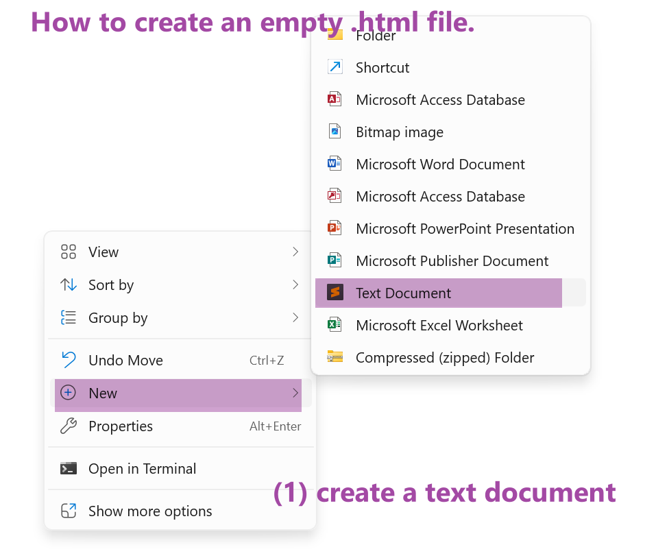
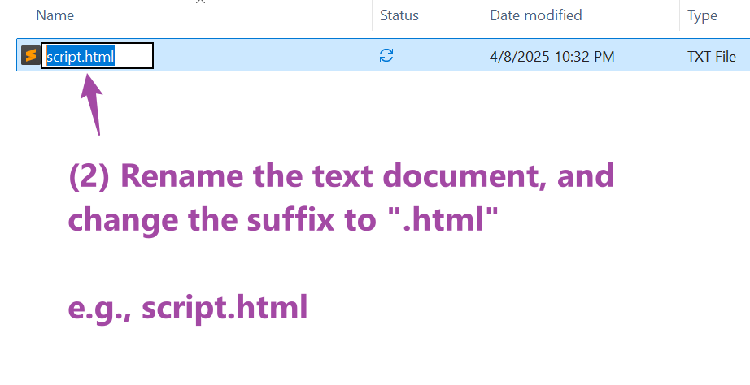
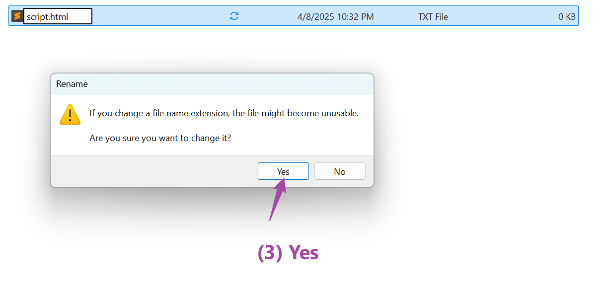

```{r setup, include=FALSE}
knitr::opts_chunk$set(echo = TRUE)
```


## Overview

This lab continues on the digital map-making using more advanced techniques and interactive features. Similar to previous labs, the examples are built upon each other with new features have been added in gradually. When replicate these examples, please compare carefully the **differences between them**: 

- _What are the new scripts/functions have been added?_
- _How they change the outcomes?_  

The zip file with Lab 7 materials can be found here: https://github.com/fuzhen-yin/uccs_cartography/blob/main/lab_materials/lab7.zip

(Don't know how to download the data? Please read: [Lab 4 - Overview](https://fuzhen-yin.github.io/uccs_cartography/lab4.html))

<br>

### Data
In this lab, we are going to play with a relatively large dataset, [Denver Tree Inventory Data](https://data.colorado.gov/Environment/Map-of-Tree-Inventory-Denver/hzmx-2dfk). The original dataset contains over 330k of records showing detailed information about every tree in Denver. I have cleaned the data a little bit to only include trees (~200k) of the top 10 genera: Ash, Crabapple, Elm, Hackberry, Honeylocust, Linden, Maple, Oak, Pine, and Spruce. 

In the Lab7.zip file, you can find two datasets about [Denver Tree Inventory Data](https://data.colorado.gov/Environment/Map-of-Tree-Inventory-Denver/hzmx-2dfk) in _.geojson_ format: 

- **"denver_tree_top_10_genus.geojson"** shows individual trees of the top 10 genera and is used for **Example 12-14**;
- **"denver_hexagon_tree_count_top10.geojson"** aggregates trees into a grid of hexagon and counts the number of trees of each genus. It is used for **Example 15-17**.  

Both datasets have been loaded to maps in the **SCRIPT**. After having uploaded them to Mapbox as tilesets, there is **NO NEED** to load them to the base map in Mapbox studio. 

### Before Starts
This lab continues to use Mapbox for (1) data hosting; (2) base map design and use Mapbox GL for (3) digital mapping. 

- Go to Mapbox studio to **create a base map** and style it. 
- **Upload** the two datasets as tilesets 
- go to the "Lab 7" folder to create an **empty .html script** and start to work on the examples.   

The screenshots below explain how to create a blank **.html** by changing the suffix of a text document. 

{width=70%}

{width=70%}

{width=70%}


:::: {.bluebox data-latex=""}
::: {.left data-latex=""}
**Submission**
:::

From this lab 7, you would need to **publish the required webpages on GitHub, obtain the publicly accessible urls and submit the urls using the 'text entry' on Canvas**. Remember the process of publishing the midterm project on GitHub? It's the same process! However, the GitHub page tutorial could be find [here](https://fuzhen-yin.github.io/uccs_cartography/index.html#Publish_Your_Map_GitHub).  

In addition to replicate all examples 12-17 using your own base map & tilesets, please submit the **urls** of the following webpages: 

- **Revise Example 12** by using your own base map (30 pts).
- **Revise Example 14** by using your own base map, and changing the color palette & legends for different genera. Move the positions of title box and legend to the left side. (30 pts). 
- **Revise Example 16** by using your own base map, and changing the color palette, for the hexagon heat map. Try a different data scaling rule (other than linear) to color the hexagon.  (35 pts)
- **BONUS! Revise Example 17** by adding a selection feature (similar to example 16). The selection feature allows user to toggle the view and see 3D density hexagon maps of different tree genera. _**Hint**: some scripts & code structure in Example 16 could be useful_. (5 pts)

::::

## Point Mapping

### Example 12
This is a very basic tree point map. 

```{html, eval=FALSE}

<html>

<head>
<meta charset="utf-8" />
<title>Mapbox Example 12- Denver Tree</title>

<meta name="viewport" content="initial-scale=1,maximum-scale=1,user-scalable=no">
<link href="https://api.mapbox.com/mapbox-gl-js/v3.10.0/mapbox-gl.css" rel="stylesheet">
<script src="https://api.mapbox.com/mapbox-gl-js/v3.10.0/mapbox-gl.js"></script>

<style>
    body { margin: 0; padding: 0; }
    #map { position: absolute; top: 0; bottom: 0; width: 100%; };
</style>

</head>

<body>
<div id="map"></div>

<script>

    //Put your mapbox access token here
    mapboxgl.accessToken = 'pk.eyJ1IjoianVuemhpbWFnZXIiLCJhIjoiY2s5eHBpdzkzMDVkZjNtcnQybzd6YmlxcyJ9.9porJ3w9YRjSl6X0Mx-WUg';  

        // Load a new map in the 'map' HTML div
        var map = new mapboxgl.Map({
            container: 'map', // container id
            style: 'mapbox://styles/junzhimager/cm97e15qe00al01sz884x81p4', // Put your mapbox style ID here
            center: [-104.951046, 39.732470], // starting position [lng, lat]
            zoom: 12 // starting zoom
        });


        // When loading the map
        map.on('load', function() {


            // Add a TREE POINT layer to the map 
            map.addLayer({
                'id':'denver_tree_point',
                'type':'circle',
                'source':{
                    type:'vector',
                    url:'mapbox://junzhimager.bh6jbmgj' // After "mapbox://" paste your Mapbox tileset ID
                },
                'source-layer':'denver_tree_top_10_genus-48xeds', // name of tilesets
                'layout':{
                    'visibility': 'visible'
                },
                'paint': {
                    'circle-color':'#86b049',
                    'circle-opacity':1,
                    'circle-stroke-width':0.5,
                    'circle-stroke-color':'white',          //points on the graph
                    'circle-stroke-opacity':0.5,
                    'circle-radius':2
                }
            });
            

        })

</script>

</body>
</html>
     
```

When you double click on the html file you have created, it should open in your **default web browser** software, and show a map as the image below. 

{width=100%}
<br>

### Example 13
Color the tree points based on their genus. 

```{html, eval=FALSE}

<html>

<head>
<meta charset="utf-8" />
<title>Mapbox Example 13 - Colorful Denver Tree</title>

<meta name="viewport" content="initial-scale=1,maximum-scale=1,user-scalable=no">
<link href="https://api.mapbox.com/mapbox-gl-js/v3.10.0/mapbox-gl.css" rel="stylesheet">
<script src="https://api.mapbox.com/mapbox-gl-js/v3.10.0/mapbox-gl.js"></script>

<style>
    body { margin: 0; padding: 0; }
    #map { position: absolute; top: 0; bottom: 0; width: 100%; };
</style>

</head>

<body>
<div id="map"></div>

<script>

    //Put your mapbox access token here
    mapboxgl.accessToken = 'pk.eyJ1IjoianVuemhpbWFnZXIiLCJhIjoiY2s5eHBpdzkzMDVkZjNtcnQybzd6YmlxcyJ9.9porJ3w9YRjSl6X0Mx-WUg';  

        // Load a new map in the 'map' HTML div
        var map = new mapboxgl.Map({
            container: 'map', // container id
            style: 'mapbox://styles/junzhimager/cm97e15qe00al01sz884x81p4', // Put your mapbox style ID here
            center: [-104.951046, 39.732470], // starting position [lng, lat]
            zoom: 12 // starting zoom
        });


        // When loading the map
        map.on('load', function() {


            // Add a TREE POINT layer to the map 
            map.addLayer({
                'id':'denver_tree_point',
                'type':'circle',
                'source':{
                    type:'vector',
                    url:'mapbox://junzhimager.bh6jbmgj' // After "mapbox://" paste your Mapbox tileset ID
                },
                'source-layer':'denver_tree_top_10_genus-48xeds', // name of tilesets
                'layout':{
                    'visibility': 'visible'
                },
                'paint': {
                    // color circle by tree genus
                    'circle-color':[
                        'match',
                        ['get', 'genus'],
                        'Linden','#a6cee3',
                        'Maple','#1f78b4',
                        'Honeylocust','#b2df8a',
                        'Crabapple','#33a02c',
                        'Oak','#fb9a99',
                        'Elm','#e31a1c',
                        'Pine','#fdbf6f',
                        'Ash','#ff7f00',
                        'Hackberry','#cab2d6',
                        'Spruce','#6a3d9a',
                        '#ffff99', // default color 
                    ],
                    'circle-opacity':1,
                    'circle-stroke-width':0.5,
                    'circle-stroke-color':'white',          //points on the graph
                    'circle-stroke-opacity':0.5,

                    // Make circles larger as the user zooms from z12 to z22.
                    'circle-radius':{
                        'base':1.75,
                        'stops': [
                            [12, 2],
                            [22, 150]
                        ]
                    }
                }
            });
            

        })

</script>

</body>
</html>
     
```

When you double click on the html file you have created, it should open in your **default web browser** software, and show a map as the image below. 

{width=100%}
<br>


### Example 14
Adding a title box and legend to make the map easy to understand.   

```{html, eval=FALSE}

<html>

<head>
<meta charset="utf-8" />
<title>Mapbox Example 14 - Legend</title>

<meta name="viewport" content="initial-scale=1,maximum-scale=1,user-scalable=no">
<link href="https://api.mapbox.com/mapbox-gl-js/v3.10.0/mapbox-gl.css" rel="stylesheet">
<script src="https://api.mapbox.com/mapbox-gl-js/v3.10.0/mapbox-gl.js"></script>

<style>

    /*  Legend Style Sheet  */
    .legend {
        background-color: #fff;
        border-radius: 3px;
        bottom: 30px;
        box-shadow: 0 1px 2px rgba(0, 0, 0, 0.1);
        font:
            12px/20px 'Helvetica Neue',
            Arial,
            Helvetica,
            sans-serif;
        padding: 10px;
        position: absolute;
        right: 10px;
        z-index: 1;
    }
    .legend h4 {
        margin: 0 0 10px;
    }

    .legend div span {
        border-radius: 50%;
        display: inline-block;
        height: 10px;
        margin-right: 5px;
        width: 10px;
    }

    /* Map overlay style sheet  */

    .map-overlay {
    font: 12px/20px 'Helvetica Neue', Arial, Helvetica, sans-serif;
    position: absolute;
    width: 380px;
    min-width: 380px;
    top: 0;
    right: 0;
    padding: 10px;
    }
    .map-overlay .map-overlay-inner {
        background-color: #fff;
        box-shadow:0 1px 2px rgba(0, 0, 0, 0.20);
        border-radius: 3px;
        padding: 10px;
        margin-bottom: 10px;
    }
    .map-overlay h2 {
        line-height: 24px;
        display: block;
        margin: 0 0 10px;
    }
    .map-overlay p.credit {
       margin: 0;
       padding: 0;
    }

    /*  Body & Map Style Sheet  */
    body { margin: 0; padding: 0; }
    #map { position: absolute; top: 0; bottom: 0; width: 100%; };

</style>

</head>

<body>
<div id="map"></div>

<div class='map-overlay'> 
    <div class='map-overlay-inner'>
        <h2> Denver Tree Inventory</h2>
        <p class="credit"> This map visualizes the top 10 tree genera in Denver including Maple, Honeylocust, Crabapple, Oak, Elm, Pine, Ash, Hackberry and Spruce. It is created using the <a href="https://data.colorado.gov/Environment/Map-of-Tree-Inventory-Denver/hzmx-2dfk"> Denver Tree Inventory data </a>. </p>
        
    </div>
</div>

<div id="treecolor-legend" class="legend" style="display: none">
    <h4>Tree Genus</h4>
    <div><span style="background-color: #1f78b4"></span>Maple</div>
    <div><span style="background-color: #b2df8a"></span>Honeylocust</div>
    <div><span style="background-color: #33a02c"></span>Crabapple</div>
    <div><span style="background-color: #fb9a99"></span>Oak</div>
    <div><span style="background-color: #e31a1c"></span>Elm</div>
    <div><span style="background-color: #fdbf6f"></span>Pine</div>
    <div><span style="background-color: #ff7f00"></span>Ash</div>
    <div><span style="background-color: #cab2d6"></span>Hackberry</div>
    <div><span style="background-color: #6a3d9a"></span>Spruce</div>
    <div><span style="background-color: #ffff99"></span>Others</div>
</div>

<script>

    //Put your mapbox access token here
    mapboxgl.accessToken = 'pk.eyJ1IjoianVuemhpbWFnZXIiLCJhIjoiY2s5eHBpdzkzMDVkZjNtcnQybzd6YmlxcyJ9.9porJ3w9YRjSl6X0Mx-WUg';  

        // Load a new map in the 'map' HTML div
        var map = new mapboxgl.Map({
            container: 'map', // container id
            style: 'mapbox://styles/junzhimager/cm97e15qe00al01sz884x81p4', // Put your mapbox style ID here
            center: [-104.951046, 39.732470], // starting position [lng, lat]
            zoom: 12 // starting zoom
        });


        // When loading the map
        map.on('load', function() {


            // Add a TREE POINT layer to the map 
            map.addLayer({
                'id':'denver_tree_point',
                'type':'circle',
                'source':{
                    type:'vector',
                    url:'mapbox://junzhimager.bh6jbmgj' // After "mapbox://" paste your Mapbox tileset ID
                },
                'source-layer':'denver_tree_top_10_genus-48xeds', // name of tilesets
                'layout':{
                    'visibility': 'visible'
                },
                'paint': {
                    // color circle by tree genus
                    'circle-color':[
                        'match',
                        ['get', 'genus'],
                        'Linden','#a6cee3',
                        'Maple','#1f78b4',
                        'Honeylocust','#b2df8a',
                        'Crabapple','#33a02c',
                        'Oak','#fb9a99',
                        'Elm','#e31a1c',
                        'Pine','#fdbf6f',
                        'Ash','#ff7f00',
                        'Hackberry','#cab2d6',
                        'Spruce','#6a3d9a',
                        '#ffff99', // default color 
                    ],
                    'circle-opacity':1,
                    'circle-stroke-width':0.5,
                    'circle-stroke-color':'white',          //points on the graph
                    'circle-stroke-opacity':0.5,

                    // Make circles larger as the user zooms from z12 to z22.
                    'circle-radius':{
                        'base':1.75,
                        'stops': [
                            [12, 2],
                            [22, 150]
                        ]
                    }
                }
            });
            
            // add legend 
            const TreeColorLegend = document.getElementById('treecolor-legend');
            TreeColorLegend.style.display = 'block';

        })

</script>

</body>
</html>
     
```

When you double click on the html file you have created, it should open in your **default web browser** software, and show a map as the image below. 

{width=100%}
<br>

## Hexagon Tree Density

### Example 15
Now, let's use the tree hexagon dataset for mapping. 

```{html, eval=FALSE}

<html>

<head>
<meta charset="utf-8" />
<title>Mapbox Example 15 - Hex </title>

<meta name="viewport" content="initial-scale=1,maximum-scale=1,user-scalable=no">
<link href="https://api.mapbox.com/mapbox-gl-js/v3.10.0/mapbox-gl.css" rel="stylesheet">
<script src="https://api.mapbox.com/mapbox-gl-js/v3.10.0/mapbox-gl.js"></script>

<style>

    /*  Legend Style Sheet  */
    .legend {
        background-color: #fff;
        border-radius: 3px;
        bottom: 30px;
        box-shadow: 0 1px 2px rgba(0, 0, 0, 0.1);
        font:
            12px/20px 'Helvetica Neue',
            Arial,
            Helvetica,
            sans-serif;
        padding: 10px;
        position: absolute;
        right: 10px;
        z-index: 1;
    }
    .legend h4 {
        margin: 0 0 10px;
    }

    .legend div span {
        border-radius: 50%;
        display: inline-block;
        height: 10px;
        margin-right: 5px;
        width: 10px;
    }

    /* Map overlay style sheet  */

    .map-overlay {
    font: 12px/20px 'Helvetica Neue', Arial, Helvetica, sans-serif;
    position: absolute;
    width: 380px;
    min-width: 380px;
    top: 0;
    right: 0;
    padding: 10px;
    }
    .map-overlay .map-overlay-inner {
        background-color: #fff;
        box-shadow:0 1px 2px rgba(0, 0, 0, 0.20);
        border-radius: 3px;
        padding: 10px;
        margin-bottom: 10px;
    }
    .map-overlay h2 {
        line-height: 24px;
        display: block;
        margin: 0 0 10px;
    }
    .map-overlay p.credit {
       margin: 0;
       padding: 0;
    }

    /*  Body & Map Style Sheet  */
    body { margin: 0; padding: 0; }
    #map { position: absolute; top: 0; bottom: 0; width: 100%; };

</style>

</head>

<body>
<div id="map"></div>

<div class='map-overlay'> 
    <div class='map-overlay-inner'>
        <h2> Denver Tree Hexagon </h2>
        <p class="credit"> This map uses hexagons to visualize the tree data. It is created using the <a href="https://data.colorado.gov/Environment/Map-of-Tree-Inventory-Denver/hzmx-2dfk"> Denver Tree Inventory data </a>. </p>
        
    </div>
</div>


<script>

    //Put your mapbox access token here
    mapboxgl.accessToken = 'pk.eyJ1IjoianVuemhpbWFnZXIiLCJhIjoiY2s5eHBpdzkzMDVkZjNtcnQybzd6YmlxcyJ9.9porJ3w9YRjSl6X0Mx-WUg';  

        // Load a new map in the 'map' HTML div
        var map = new mapboxgl.Map({
            container: 'map', // container id
            style: 'mapbox://styles/junzhimager/cm97e15qe00al01sz884x81p4', // Put your mapbox style ID here
            center: [-104.951046, 39.732470], // starting position [lng, lat]
            zoom: 11 // starting zoom
        });


        // When loading the map
        map.on('load', function() {


            // Add a TREE HEXAGON layer to the map 
            map.addLayer({
                'id':'denver_tree_point',
                'type':'fill',
                'source':{
                    type:'vector',
                    url:'mapbox://junzhimager.cnyhw4p3' // After "mapbox://" paste your Mapbox tileset ID
                },
                'source-layer':'denver_hexagon_tree_count_top-5j28n7', // name of tilesets
                'layout':{
                    'visibility': 'visible'
                },
                'paint': {
                    // color circle by tree genus
                    'fill-color':[
                        'interpolate',
                        ['linear'],
                        ['get', 'n_all'],
                        0, "white",
                        725, '#023D54'
                    ],
                    'fill-opacity':0.7,
                    'fill-outline-color': 'grey'
                }
            });
            
            // add legend 
            const TreeColorLegend = document.getElementById('treecolor-legend');
            TreeColorLegend.style.display = 'block';

        })

</script>

</body>
</html>
     
```

When you double click on the html file you have created, it should open in your **default web browser** software, and show a map as the image below. 

{width=100%}
<br>


### Example 16
Adding a selection feature where users can toggle the map of different tree genera.   

```{html, eval=FALSE}

<html>

<head>
<meta charset="utf-8" />
<title>Mapbox Example 16 - Select Layer </title>

<meta name="viewport" content="initial-scale=1,maximum-scale=1,user-scalable=no">
<link href="https://api.mapbox.com/mapbox-gl-js/v3.10.0/mapbox-gl.css" rel="stylesheet">
<script src="https://api.mapbox.com/mapbox-gl-js/v3.10.0/mapbox-gl.js"></script>

<style>

    /*  Legend Style Sheet  */
    .legend {
        background-color: #fff;
        border-radius: 3px;
        bottom: 30px;
        box-shadow: 0 1px 2px rgba(0, 0, 0, 0.1);
        font:
            12px/20px 'Helvetica Neue',
            Arial,
            Helvetica,
            sans-serif;
        padding: 10px;
        position: absolute;
        right: 10px;
        z-index: 1;
    }
    .legend h4 {
        margin: 0 0 10px;
    }

    .legend div span {
        border-radius: 50%;
        display: inline-block;
        height: 10px;
        margin-right: 5px;
        width: 10px;
    }

    /* Map overlay style sheet  */

    .map-overlay {
    font: 12px/20px 'Helvetica Neue', Arial, Helvetica, sans-serif;
    position: absolute;
    width: 380px;
    min-width: 380px;
    top: 0;
    right: 0;
    padding: 10px;
    }
    .map-overlay .map-overlay-inner {
        background-color: #fff;
        box-shadow:0 1px 2px rgba(0, 0, 0, 0.20);
        border-radius: 3px;
        padding: 10px;
        margin-bottom: 10px;
    }
    .map-overlay h2 {
        line-height: 24px;
        display: block;
        margin: 0 0 10px;
    }
    .map-overlay p.credit {
       margin: 0;
       padding: 0;
    }

    /*  Body & Map Style Sheet  */
    .map-overlay-inner fieldset {
        border: none;
        padding: 0;
        margin: 0 0 10px;
    }

    /*  Body & Map Style Sheet  */
    body { margin: 0; padding: 0; }
    #map { position: absolute; top: 0; bottom: 0; width: 100%; };

</style>

</head>

<body>
<div id="map"></div>

<div class='map-overlay'> 
    <div class='map-overlay-inner'>
        <h2> Denver Tree Hexagon </h2>
        
        <fieldset>
            <label>Select layer</label>
            <select id="data_layer" name="layer">
                <!-- Each value matches a layer ID. -->
                <option value="0">All Genera</option>            
                <option value="1">Ash</option>
                <option value="2">Crabapple</option>
                <option value="3">Elm</option>
                <option value="4">Hackberry</option>
                <option value="5">Honeylocust</option>
                <option value="6">Linden</option>
                <option value="7">Maple</option>
                <option value="8">Oak</option>
                <option value="9">Pine</option>
                <option value="10">Spruce</option>
            </select>
        </fieldset>

        <p class="credit"> This map uses hexagons to visualize the tree data. It is created using the <a href="https://data.colorado.gov/Environment/Map-of-Tree-Inventory-Denver/hzmx-2dfk"> Denver Tree Inventory data </a>. </p>

    </div>
</div>


<script>

    //Put your mapbox access token here
    mapboxgl.accessToken = 'pk.eyJ1IjoianVuemhpbWFnZXIiLCJhIjoiY2s5eHBpdzkzMDVkZjNtcnQybzd6YmlxcyJ9.9porJ3w9YRjSl6X0Mx-WUg';  

        // Load a new map in the 'map' HTML div
        var map = new mapboxgl.Map({
            container: 'map', // container id
            style: 'mapbox://styles/junzhimager/cm97e15qe00al01sz884x81p4', // Put your mapbox style ID here
            center: [-104.951046, 39.732470], // starting position [lng, lat]
            zoom: 11 // starting zoom
        });


        // When loading the map
        map.on('load', function() {

            // Add a TREE HEXAGON layer to the map 
            map.addLayer({
                'id':'denver_tree_point',
                'type':'fill',
                'source':{
                    type:'vector',
                    url:'mapbox://junzhimager.cnyhw4p3' // After "mapbox://" paste your Mapbox tileset ID
                },
                'source-layer':'denver_hexagon_tree_count_top-5j28n7', // name of tilesets
                'layout':{
                    'visibility': 'visible'
                },
                'paint': {
                    // color circle by tree genus
                    'fill-color':[
                        'interpolate',
                        ['linear'],
                        ['get', 'n_all'],
                        0, "white",
                        720, '#081D58',

                    ],
                    'fill-opacity':0.7,
                    'fill-outline-color': 'grey'
                }
            });


        })

        // Add an event listener to monitor the selection of tree species 

        var lt_genus = [
            "n_all", 
            "n_Ash", "n_Crabapple", 
            "n_Elm", "n_Hackberry", 
            "n_Honeylocust", "n_Linden", 
            "n_Maple", "n_Oak",
            "n_Pine", "n_Spruce"
        ]

        var lt_g_max_range = [
            725, // max value range for "n_all"
            199, // max value range for "n_Ash"
            102, // max value range for "n_Crabapple"
            108, // max value range for "n_Elm"
            48, // max value range for "n_Hackberry"
            182, // max value range for "n_Honeylocust"
            140, // max value range for "n_Linden"
            171, // max value range for "n_Maple"
            170, // max value range for "n_Oak"
            254, // max value range for "n_Pine"
            94, // max value range for "n_Spruce"
        ]

        document.getElementById('data_layer').addEventListener('change', function(e){

            var genus_selected = lt_genus[e.target.value]
            var genus_s_max = lt_g_max_range[e.target.value]

            map.setPaintProperty("denver_tree_point", 'fill-color', [
                        'interpolate',
                        ['linear'],
                        ['get', genus_selected],
                        0, "white",
                        genus_s_max, '#081D58',
                    ]);
        })


</script>

</body>
</html>
     
```

When you double click on the html file you have created, it should open in your **default web browser** software, and show a map as the image below. 

{width=100%}
<br>

## 2.5D Tree Density

### Example 17
Use mapbox's fill-extrusion feature to a create 2.5D map.    

```{html, eval=FALSE}

<html>

<head>
<meta charset="utf-8" />
<title>Mapbox Example 17 - 2.5D Tree Hex </title>

<meta name="viewport" content="initial-scale=1,maximum-scale=1,user-scalable=no">
<link href="https://api.mapbox.com/mapbox-gl-js/v3.10.0/mapbox-gl.css" rel="stylesheet">
<script src="https://api.mapbox.com/mapbox-gl-js/v3.10.0/mapbox-gl.js"></script>

<style>

    /*  Legend Style Sheet  */
    .legend {
        background-color: #fff;
        border-radius: 3px;
        bottom: 30px;
        box-shadow: 0 1px 2px rgba(0, 0, 0, 0.1);
        font:
            12px/20px 'Helvetica Neue',
            Arial,
            Helvetica,
            sans-serif;
        padding: 10px;
        position: absolute;
        right: 10px;
        z-index: 1;
    }
    .legend h4 {
        margin: 0 0 10px;
    }

    .legend div span {
        border-radius: 50%;
        display: inline-block;
        height: 10px;
        margin-right: 5px;
        width: 10px;
    }

    /* Map overlay style sheet  */

    .map-overlay {
    font: 12px/20px 'Helvetica Neue', Arial, Helvetica, sans-serif;
    position: absolute;
    width: 380px;
    min-width: 380px;
    top: 0;
    right: 0;
    padding: 10px;
    }
    .map-overlay .map-overlay-inner {
        background-color: #fff;
        box-shadow:0 1px 2px rgba(0, 0, 0, 0.20);
        border-radius: 3px;
        padding: 10px;
        margin-bottom: 10px;
    }
    .map-overlay h2 {
        line-height: 24px;
        display: block;
        margin: 0 0 10px;
    }
    .map-overlay p.credit {
       margin: 0;
       padding: 0;
    }

    /*  Body & Map Style Sheet  */
    .map-overlay-inner fieldset {
        border: none;
        padding: 0;
        margin: 0 0 10px;
    }

    /*  Body & Map Style Sheet  */
    body { margin: 0; padding: 0; }
    #map { position: absolute; top: 0; bottom: 0; width: 100%; };

</style>

</head>

<body>
<div id="map"></div>

<div class='map-overlay'> 
    <div class='map-overlay-inner'>
        <h2> 2.5D Denver Tree Map </h2>

        <p class="credit"> This map uses hexagons to visualize the tree data. It is created using the <a href="https://data.colorado.gov/Environment/Map-of-Tree-Inventory-Denver/hzmx-2dfk"> Denver Tree Inventory data </a>. </p>

        <p class="credit"> Zoom in to <a href="#" class="credit" id="den_view">Denver</a> </p>

    </div>
</div>


<script>

    //Put your mapbox access token here
    mapboxgl.accessToken = 'pk.eyJ1IjoianVuemhpbWFnZXIiLCJhIjoiY2s5eHBpdzkzMDVkZjNtcnQybzd6YmlxcyJ9.9porJ3w9YRjSl6X0Mx-WUg';  

        // Load a new map in the 'map' HTML div
        var map = new mapboxgl.Map({
            container: 'map', // container id
            style: 'mapbox://styles/junzhimager/cm97e15qe00al01sz884x81p4', // Put your mapbox style ID here
            center: [-104.951046, 39.732470], // starting position [lng, lat]
            zoom: 11, // starting zoom
            pitch: 50 // tilt of the viewpoint in degrees
        });


        // When loading the map
        map.on('load', function() {     
            
            // Set global light properties which influence 3D layer shadows
            map.setLight({color: "#fff", intensity: 0.15, position: [1, 180, 30]});
            // Add standard navigation control
            map.addControl(new mapboxgl.NavigationControl(), 'bottom-right');   

            // Load the TREE HEXAGON layer in 3D by setting the type to 'fill-extrusion' 
            map.addLayer({
                'id':'denver_tree_point',
                'type':'fill-extrusion',
                'source':{
                    type:'vector',
                    url:'mapbox://junzhimager.cnyhw4p3' // After "mapbox://" paste your Mapbox tileset ID
                },
                'source-layer':'denver_hexagon_tree_count_top-5j28n7', // name of tilesets
                'layout':{
                    'visibility': 'visible'
                },
                'paint': {
                    // color circle by tree genus
                    'fill-extrusion-color':[
                        'interpolate',
                        ['linear'],
                        ['get', 'n_all'],
                        0, "white",
                        720, '#081D58',

                    ],
                    'fill-extrusion-height':['*', 3, ['get', 'n_all']],  //set the height to 3 times of the value of n_all
                    'fill-extrusion-opacity':0.8
                }
            });


        })

        // Add an event listener when users clicking on "zoom in to Denver" 
        document.getElementById('den_view').addEventListener('click', function(e){

            map.flyTo({
                center:[-104.961046, 39.732470],
                zoom:12,
                speed:0.3,
                pitch:60
            })
        })


</script>

</body>
</html>
     
```

When you double click on the html file you have created, it should open in your **default web browser** software, and show a map as the image below. 

{width=100%}
<br>
